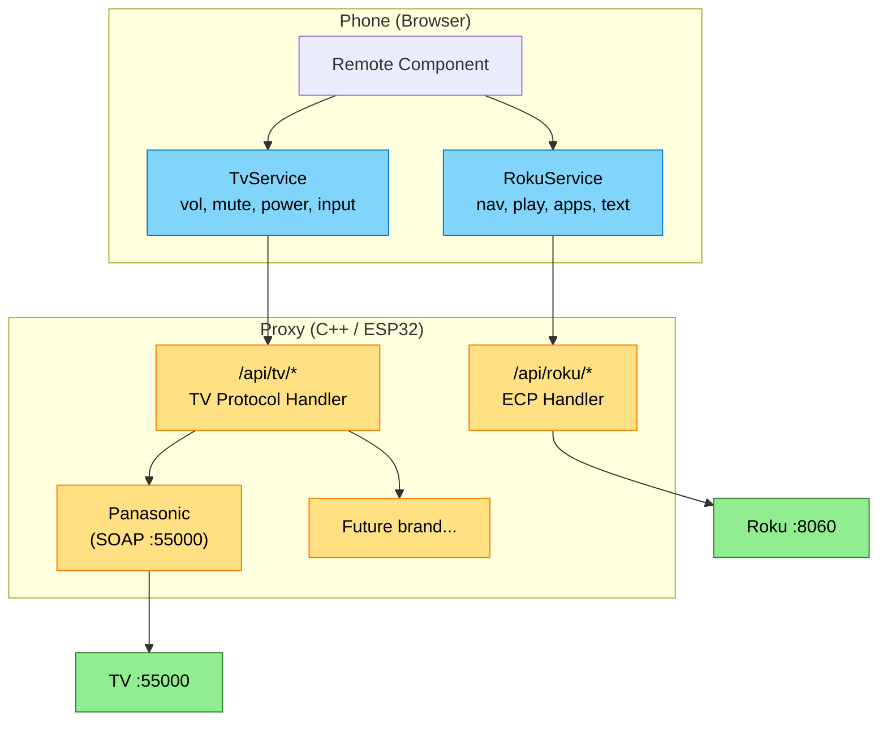
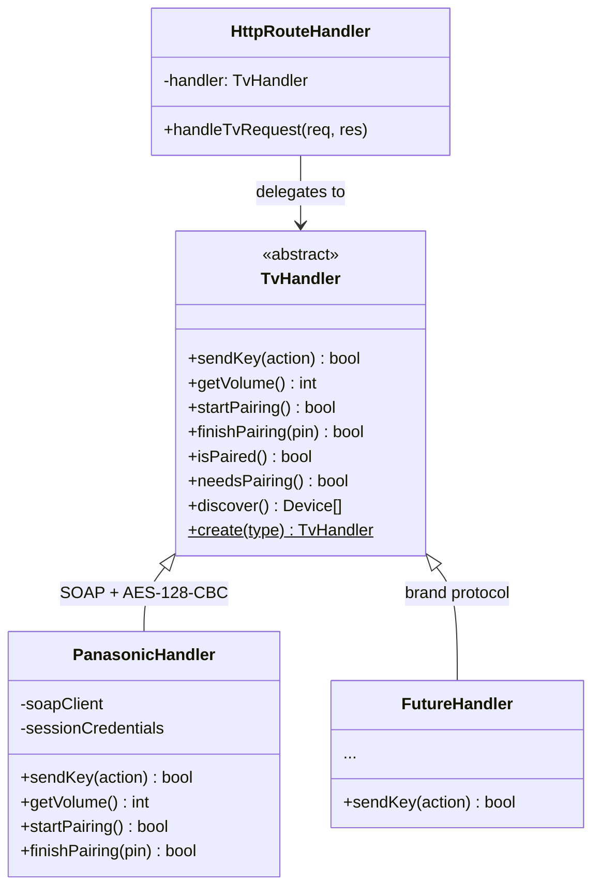
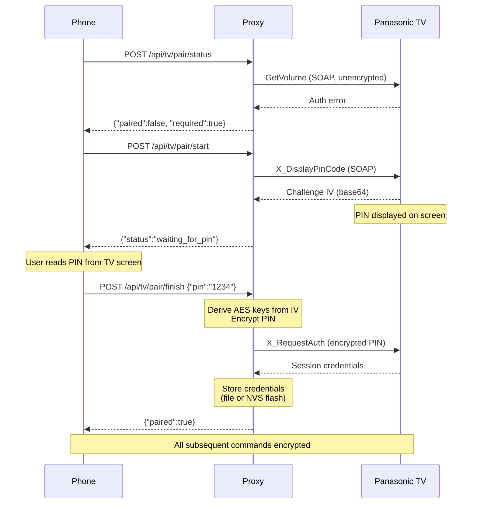
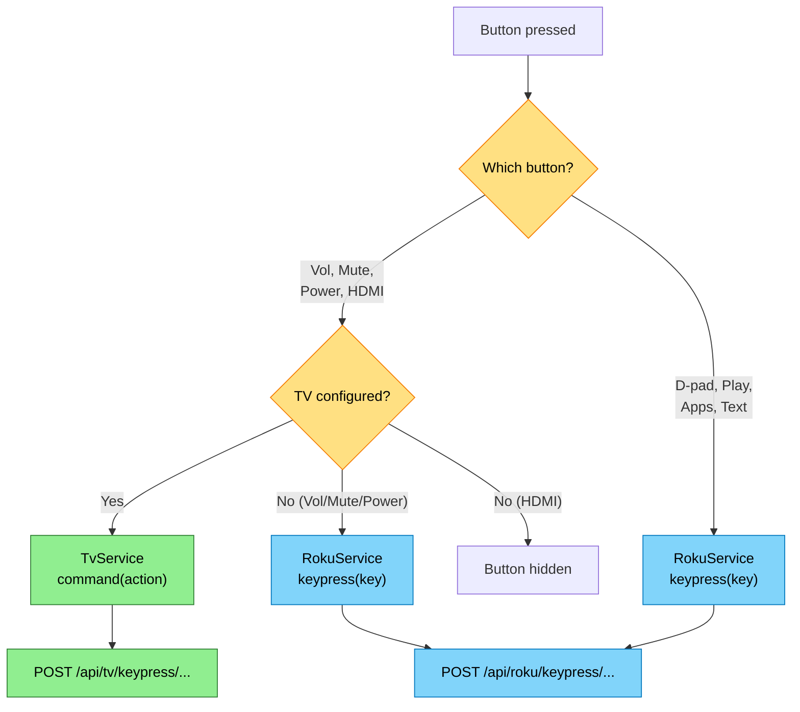

# Design — RokuRemote

How it could be built. Contracts, architecture, verification. No implementation.

---

## Architecture Overview

```
┌─────────────────────────────────────────────────┐
│                    AWS (S3/CloudFront)           │
│    Hosts static Angular app (HTTP allowed for   │
│    mixed-content compat with local proxy)       │
└──────────────────────┬──────────────────────────┘
                       │ HTTP/HTTPS (serve UI)
                       ▼
┌─────────────────────────────────────────────────┐
│                  Phone (Browser)                 │
│                                                  │
│  ┌─────────┐ ┌──────────┐ ┌───────┐ ┌───────┐  │
│  │  Setup  │ │  Remote  │ │ Apps  │ │ Audio │  │
│  └────┬────┘ └────┬─────┘ └───┬───┘ └───┬───┘  │
│       │           │           │          │      │
│  ┌────┴───────────┴───────────┴──────────┴───┐  │
│  │  Proxy Service + Roku Service + TvService │  │
│  │  (routes all requests through proxy)      │  │
│  └──────────────────────┬────────────────────┘  │
└─────────────────────────┼────────────────────────┘
                          │ HTTP (local network)
                          ▼
            ┌──────────────────────────┐
            │   Local Proxy (C++ or    │
            │   ESP32, same contract)  │
            │                          │
            │  • CORS headers          │
            │  • ECP forwarding        │
            │  • TV protocol handler   │
            │  • SSDP discovery        │
            │  • WS auth + RTP recv    │
            │  • Audio serving         │
            └──────────┬───┬───────────┘
                       │   │
          HTTP/WS/RTP  │   │  SOAP/HTTP
          (local net)  │   │  (local net)
                       ▼   ▼
          ┌────────┐  ┌────────┐
          │ Roku   │  │   TV   │
          │ :8060  │  │ :55000 │
          └────────┘  └────────┘
```

### Key Decision: All Requests Route Through a Local Proxy

- The browser cannot talk directly to the Roku — ECP has no CORS headers, and browsers block cross-origin HTTP requests.
- A local proxy (C++ desktop app during development, ESP32 for deployment) adds CORS headers and forwards all ECP requests.
- The same proxy handles SSDP discovery and private listening (WebSocket auth, RTP reception, audio serving).
- The Angular app is a pure browser app with zero native dependencies. All platform-specific work (UDP, multicast, RTP) lives in the proxy.
- The desktop proxy and ESP32 proxy expose the **same HTTP API contract** — the Angular app doesn't know or care which one it's talking to.

---

## Phase 1: Core Control

**Supports:** Flow 1, North Star #1-4, #11-16

### First-Run Setup & Connection (Flow 0)

- **Proxy URL**: Configurable via a collapsible "Proxy Settings" section on the setup page. Prefer `http://roku-proxy/` when the router registers DHCP hostnames, with fallbacks to `http://roku-proxy.local/` (mDNS) and device IP. Users can override to any IP/port and reset to default. Saved in localStorage.
- **Roku discovery**: If the proxy is reachable, SSDP auto-discovery via "Discover Roku Devices" button. Manual IP entry remains as fallback.
- **Connection check**: On connect, attempt `GET /query/device-info`.
  - Success with ECP enabled → Save IP, navigate to **app launcher** view (default landing page).
  - Success with ECP limited → Save IP, navigate to **remote** view (Apps button hidden).
  - "Limited mode" error → Show setup instructions: *Settings > System > Advanced System Settings > Control by Mobile Apps > Network Access > Enabled*. Offer "Try Again".
  - Timeout/unreachable → Show "Roku not found at this IP" with option to re-enter.
  - Tip for finding IP → Show: *On your Roku: Settings > Network > About*.
- **Persistence**: Save last-known Roku IP, proxy URL, and ECP mode in localStorage. On next open, try the saved IP first. If it fails, prompt for re-entry.

### Remote Control Interface

- **D-pad**: Up, Down, Left, Right, Select (OK) — arranged as a circular/cross pad.
- **Navigation**: Home, Back.
- **Playback**: Play/Pause, Rewind, Fast Forward, Instant Replay.
- **Volume**: Volume Up, Volume Down, Mute.
- **Power**: Power On, Power Off (or toggle).
- **Text input**: A text field that sends characters via `Lit_<char>` keypresses. Include a "Send" keyboard approach — type in the field, characters are sent as you type or on submit.
- **Each button** sends a keypress command via the proxy → Roku.

### Command Throttling

- Minimum 50ms between consecutive keypress requests to avoid overwhelming the Roku.
- For held buttons (e.g., volume), use `keydown`/`keyup` with repeat at a safe interval.

### Roku ECP Contracts (via proxy)

All ECP requests are routed through the proxy at `GET/POST /roku/<path>?ip=<roku-ip>`. The proxy forwards to the Roku and adds CORS headers to the response.

| ECP Path | Method | Purpose |
|---|---|---|
| `/query/device-info` | GET | Verify connection, get device name/model/capabilities |
| `/keypress/<key>` | POST | Send button press |
| `/keydown/<key>` | POST | Start held button |
| `/keyup/<key>` | POST | Release held button |

### Failure Handling

- HTTP request to Roku fails → show "Roku unreachable" banner, offer re-entry of IP.
- Timeout on any ECP request → 3 second timeout, then show disconnected state.

---

## Phase 2: App Launcher

**Supports:** Flow 2, North Star #5-7

### App List

- `GET /roku/query/apps?ip=<roku-ip>` (via proxy) returns XML list of installed channels.
- Parse XML → array of `{ id, name, version }`.
- For each app, fetch icon: `GET /roku/query/icon/<appId>?ip=<roku-ip>` (via proxy) → binary image (check `Content-Type` header for format).
- **Caching**: Store app list and icons in localStorage/IndexedDB. Refresh on pull-to-refresh or on a "refresh" button. Icons rarely change — cache aggressively.

### App Grid UI

- Responsive grid of tiles using CSS `auto-fill` — shows as many columns as fit the screen width (3 on phone, more on tablet/desktop, up to 960px max-width).
- Each tile shows the app icon and name. The currently active app is highlighted.
- Tap a tile → `POST /roku/launch/<appId>?ip=<roku-ip>` (via proxy). Stays on the app launcher (does not navigate away).
- Search/filter bar at the top for quick lookup when the list is long.
- Default sort: alphabetical by name (since ECP doesn't provide home screen order).
- Drag-to-reorder for custom app ordering, persisted in localStorage. Reset to alphabetical available.
- **ECP limited mode**: When Roku is in limited mode, the app launcher is inaccessible — the Apps button is hidden from the remote view and post-connect navigation goes to the remote view instead.

### Roku ECP Contracts (via proxy)

| ECP Path | Method | Purpose |
|---|---|---|
| `/query/apps` | GET | List installed channels |
| `/query/icon/<appId>` | GET | Fetch channel icon image |
| `/launch/<appId>` | POST | Launch channel |
| `/query/active-app` | GET | Show which app is currently running (highlight in grid) |

---

## Phase 3: Private Listening + Local Proxy

**Supports:** Flow 1 (discovery), Flow 3, North Star #3, #8-10, #14

### Architecture Decision: Local Proxy (Desktop + ESP32)

The proxy serves three roles across all phases:

1. **CORS proxy** — forwards ECP requests from the browser to the Roku, adding CORS headers. Required for all phases, not just Phase 3.
2. **SSDP device discovery** — finds Rokus on the network so the user doesn't need to enter an IP manually.
3. **Audio proxy** — receives RTP audio from the Roku and re-serves it to the phone browser.

**Two deployment targets, same contract:**

| Target | Use Case |
|---|---|
| **Desktop C++ proxy** (`proxy/`) | Development and desktop use. Fast iteration, runs on Mac/Windows. |
| **ESP32 firmware** (`esp32/`) | Standalone deployment. No PC needed after flashing. |

The proxy preserves the "works in a browser" principle for all phases. The phone never needs native UDP — the proxy handles RTP and re-serves audio over HTTP chunked transfer.

### Proxy Responsibilities

1. **ECP forwarding** — `GET/POST /roku/<path>?ip=<roku-ip>` forwards to the Roku at `http://<ip>:8060/<path>`, adding CORS headers to the response. This is the foundation — all remote control, app queries, and launch commands flow through this.
2. **SSDP discovery** — send M-SEARCH to 239.255.255.250:1900 with `ST: roku:ecp`, collect responses, expose found devices via HTTP API.
3. **WebSocket signaling** — connect to `ws://<roku-ip>:8060/ecp-session`, perform auth challenge-response, send `set-audio-output` with its own IP:port.
4. **RTP reception** — listen on UDP port 6970 for Opus RTP packets from the Roku. Send RTCP receiver reports back to the Roku on port 5150.
5. **Audio serving** — serve raw Opus frames to the phone over HTTP chunked transfer (2-byte length prefix per frame). Thread-safe ring buffer (max 500 frames ~10 sec).
6. **Lifecycle** — start/stop listening on command from the phone.

### Phone-to-Proxy Contract

The phone communicates with the proxy via HTTP. Both the desktop proxy and ESP32 expose the same endpoints:

| Endpoint | Method | Purpose |
|---|---|---|
| `/roku/<path>?ip=<roku-ip>` | GET/POST | Forward any ECP request to the Roku, return response with CORS headers |
| `/discover` | GET | Run SSDP discovery, return JSON array of found Roku devices `[{ ip, name, model }]` |
| `/start?roku=<ip>` | POST | Initiate private listening session with the specified Roku |
| `/stop` | POST | Tear down the session |
| `/status` | GET | Return current state (idle, connecting, authenticating, streaming, error) + error message |
| `/audio` | GET (streaming) | HTTP chunked stream of Opus frames (2-byte length prefix per frame) |

### Auth Protocol (from RPListening source)

1. Connect WebSocket to `ws://<roku-ip>:8060/ecp-session` with headers: `Sec-WebSocket-Origin: Android`, `Sec-WebSocket-Protocol: ecp-2`.
2. Receive JSON `{ notify: "authenticate", param-challenge: "<value>" }`.
3. Compute: `SHA1(challenge + transform("95E610D0-7C29-44EF-FB0F-97F1FCE4C297", shift=9))` → Base64.
4. Send JSON `{ request: "authenticate", "request-id": "0", "param-response": "<hash>" }`.
5. Receive `{ response: "authenticate", status: "200", "status-msg": "OK" }`.
6. Send `set-audio-output` with proxy's `IP:6970`.
7. RTP Opus/48kHz/stereo packets arrive on UDP 6970.

### Audio Playback on Phone

- Proxy serves raw Opus frames over HTTP chunked transfer (2-byte length prefix per frame).
- Phone decodes with `opus-decoder` npm package (Wasm, 48kHz stereo) and plays via Web Audio API with scheduled buffer playback.
- **Latency control**: User-adjustable jitter buffer depth (50–500ms, default 150ms). Lower values reduce delay but risk audio dropouts; higher values smooth jitter at the cost of delay.

### Failure Handling

- Roku doesn't support private listening → Phase 1 already knows this from `device-info`. Hide the button.
- Auth fails → show error, suggest firmware may have changed the protocol.
- Proxy unreachable → show "Proxy not found" with setup instructions.
- Stream drops → proxy reports status change, phone shows reconnect option.

---

## Phase 4: Progressive Web App (PWA)

**Supports:** North Star #11-13, Findings — PWA section

### What PWA Adds

A PWA makes the existing web app installable on mobile — launched from the home screen, running fullscreen without browser chrome, with its own app icon. No new functionality, just a better mobile experience for the app that already works.

### Manifest

A `manifest.webmanifest` at the app root declares:

| Field | Value | Why |
|---|---|---|
| `name` | Roku Remote | Shown on splash screen |
| `short_name` | Roku | Shown under home screen icon |
| `start_url` | `/` | Opens to root (setup or last-connected view) |
| `display` | `standalone` | Fullscreen, no browser chrome |
| `orientation` | `portrait` | Remote is a portrait UI |
| `theme_color` | Match app header | Status bar blends with app |
| `background_color` | Match app background | Splash screen background |
| `icons` | 192px + 512px PNG | Required sizes for Android/iOS install |

### Service Worker

Angular's `@angular/pwa` schematic provides:

- **App shell caching** — the Angular app loads instantly from cache, even offline (though the remote itself needs network to talk to the Roku/proxy).
- **Asset precaching** — JS bundles, CSS, and static assets cached on first visit.
- **Update strategy** — `SwUpdate` service detects new versions and prompts reload.

No custom offline page is needed — the remote is useless without network. The service worker's value is **instant load** and **installability**, not offline support.

### Icons

- 192x192 and 512x512 PNG icons required for Android install prompt and splash screen.
- 180x180 Apple Touch Icon for iOS "Add to Home Screen".
- Simple design: Roku-like remote icon or the app's logo, on a solid background.

### iOS Considerations

- iOS requires `<meta name="apple-mobile-web-app-capable" content="yes">` and `<link rel="apple-touch-icon">` in `index.html`.
- iOS PWAs have no install prompt — users must use Safari's "Add to Home Screen" manually.
- Status bar style controlled via `<meta name="apple-mobile-web-app-status-bar-style">`.
- Audio playback in iOS PWAs may pause when backgrounded — this is a known platform limitation noted in the findings.

### Deployment

No infrastructure changes needed. The manifest and service worker are static assets served from the same S3/CloudFront distribution. The GitHub Actions workflow already deploys all build output.

---

## Phase 5: ESP32 Self-Hosted UI

**Supports:** North Star #11-13, resolves HTTPS mixed-content limitation for PWA

### Problem

The CloudFront-hosted app runs over HTTPS, but the ESP32 proxy runs HTTP on the local network. Browsers block mixed-content requests (HTTPS page → HTTP API), and iOS forces HTTPS for home screen PWAs. This prevents the installed PWA from reaching the local proxy.

### Solution: Same-Origin Serving

The ESP32 serves both the Angular UI and the API on the same HTTP origin (port 8080). All requests are same-origin — no CORS, no mixed content, no PNA restrictions.

### Embedding Strategy

The Angular production build (~270KB gzipped) is embedded directly in the ESP32 firmware binary via CMake `EMBED_FILES`. No filesystem (SPIFFS/LittleFS) required.

| Advantage | Why |
|-----------|-----|
| Atomic updates | Web app updates with firmware — no version mismatch |
| No filesystem overhead | No wear-leveling, mount logic, or corruption risk |
| Gzip passthrough | Pre-compressed files served with `Content-Encoding: gzip` — browser decompresses |
| Simplicity | No runtime file I/O, just memory-mapped data |

### Route Structure

API routes move under `/api/` to separate them from static file serving:

| Route | Handler |
|-------|---------|
| `/api/discover`, `/api/start`, `/api/stop`, `/api/status`, `/api/audio` | Existing proxy API handlers |
| `/api/roku/*` | ECP forwarding |
| `/api/tv/*` | TV command handlers (Phase 6) |
| `/*.js`, `/*.css`, `/icons/*` | Embedded static files |
| `/` and `/*` fallback | `index.html` (SPA routing) |

### Angular Dual-Mode

The app supports two serving modes with no code changes:

| Mode | Proxy URL | API paths | Use case |
|------|-----------|-----------|----------|
| Same-origin (ESP32) | `""` (empty) | `/api/...` (relative) | Production — served from ESP32 |
| Cross-origin (CloudFront) | `http://192.168.x.x:8080` | `http://192.168.x.x:8080/api/...` (absolute) | Development or CloudFront-hosted fallback |

### Service Worker

Disabled for the ESP32 build — service workers require HTTPS on non-localhost origins. A separate Angular build configuration (`esp32`) produces a production build without service worker files. The `manifest.webmanifest` is retained for "Add to Home Screen" support where browsers allow it over HTTP.

### Build Pipeline

```
ng build --configuration esp32
    → prepare_web.sh (gzip text assets, generate CMake embed list)
        → idf.py build (firmware includes embedded web files)
            → flash to ESP32
```

The CloudFront deployment pipeline remains unchanged — the `esp32` build is an additional output, not a replacement.

---

## Phase 6: TV Control

**Supports:** Flow TV-Control (A, B, C), North Star #5-10, #23

### Context

The Roku handles streaming and navigation. The TV handles volume, mute, power, and input switching. Today, volume/mute/power buttons send Roku ECP keypresses, which only work if the Roku supports HDMI-CEC to relay them to the TV. This phase adds direct TV control — the proxy talks to the TV using its native protocol, and the app routes commands to the right device automatically.

The first supported TV type is Panasonic Viera (SOAP over HTTP, port 55000). The architecture supports adding other TV brands without changing the app or the phone-to-proxy contract.

### Inputs

- **Findings**: `docs/findings-panasonic.md` — Viera SOAP API, NRC key codes, encryption protocol, CORS absent
- **Flow**: `docs/flow-tv-control.md` — setup, routing, extensibility
- **Constraint**: No CORS on the TV's SOAP API — all commands must route through the proxy, same as Roku

### Architecture Change



*Blue = app services, Yellow = proxy handlers, Green = physical devices. Two independent command paths — a TV command never touches the Roku, a Roku command never touches the TV.*

### Phone-to-Proxy TV Contract

The phone sends generic TV actions. The proxy translates. This contract is stable across all TV types — adding a new brand changes the proxy internals, not the API.

| Endpoint | Method | Purpose |
|---|---|---|
| `/api/tv/keypress/<action>?ip=<ip>&type=<type>` | POST | Send a TV command |
| `/api/tv/volume?ip=<ip>&type=<type>` | GET | Get current volume level (0-100) |
| `/api/tv/discover?type=<type>` | GET | SSDP discovery for TVs of this type |
| `/api/tv/pair/start?ip=<ip>&type=<type>` | POST | Begin pairing — TV shows PIN |
| `/api/tv/pair/finish?ip=<ip>&type=<type>` | POST | Complete pairing — body: `{"pin":"1234"}` |
| `/api/tv/pair/status?ip=<ip>&type=<type>` | GET | Check if paired (returns `{"paired":true/false,"required":true/false}`) |

**Generic TV actions** (the `<action>` in `/api/tv/keypress/<action>`):

| Action | What it does |
|---|---|
| `volume_up` | Increment volume |
| `volume_down` | Decrement volume |
| `mute` | Toggle mute |
| `power` | Toggle power on/off |
| `hdmi1` ... `hdmi4` | Switch to HDMI input |

All responses include CORS headers (same as Roku endpoints).

### Panasonic Protocol Translation

The proxy maps generic actions to Panasonic Viera SOAP calls:

| Generic Action | Panasonic Translation | Endpoint | SOAP Action |
|---|---|---|---|
| `volume_up` | `NRC_VOLUP-ONOFF` | `/nrc/control_0` | `X_SendKey` |
| `volume_down` | `NRC_VOLDOWN-ONOFF` | `/nrc/control_0` | `X_SendKey` |
| `mute` | `NRC_MUTE-ONOFF` | `/nrc/control_0` | `X_SendKey` |
| `power` | `NRC_POWER-ONOFF` | `/nrc/control_0` | `X_SendKey` |
| `hdmi1` | `NRC_HDMI1-ONOFF` | `/nrc/control_0` | `X_SendKey` |
| `hdmi2` | `NRC_HDMI2-ONOFF` | `/nrc/control_0` | `X_SendKey` |
| `hdmi3` | `NRC_HDMI3-ONOFF` | `/nrc/control_0` | `X_SendKey` |
| `hdmi4` | `NRC_HDMI4-ONOFF` | `/nrc/control_0` | `X_SendKey` |
| `GET volume` | `GetVolume` | `/dmr/control_0` | `GetVolume` (UPnP RenderingControl) |

Using `X_SendKey` for volume (keypress approach) rather than `SetVolume` (direct set). Simpler, works on all models, matches how the Roku volume already works (discrete presses). The `GET /volume` endpoint uses the DMR `GetVolume` for reading the current level — useful for a future volume indicator but not required for the core press-and-hold pattern.

### Proxy Protocol Abstraction

The complexity of different TV protocols is contained in the proxy behind a clean interface. The HTTP route handler delegates to a protocol-specific handler based on the `type` parameter.



`TvHandler::create(type)` factory returns the right handler. The HTTP route handler calls `TvHandler` methods — it never knows about SOAP, NRC codes, or encryption.

**ESP32:** Same abstraction, same handler interface. The Panasonic handler uses `esp_http_client` instead of `httplib` for SOAP requests, but the interface is identical.

### Encryption & Pairing (2018+ Panasonic)

The `PanasonicHandler` probes the TV on first contact (a `GetVolume` request). If the TV rejects unauthenticated requests, the handler flags `needsPairing() = true`.



**Credential storage:**
- **Desktop proxy**: JSON file (`~/.roku-proxy/tv_config.json`)
- **ESP32**: NVS (Non-Volatile Storage) — same mechanism as Wi-Fi credentials

Once paired, the handler encrypts all subsequent SOAP requests using the stored session credentials. Re-pairing is only needed if credentials are lost (NVS erased, config file deleted). Pre-2018 TVs skip this entirely — the initial `GetVolume` probe succeeds without auth.

### Angular App Changes

**New `TvService`** (alongside `RokuService`):

- Stores TV type and IP in localStorage (same pattern as Roku IP)
- Has its own independent command queue with throttling (TV commands don't block Roku commands)
- Methods: `command(action)`, `getVolume()`, pairing methods
- Constructs URLs: `${base}/tv/keypress/${action}?ip=${tvIp}&type=${tvType}`
- Exposes `configured$` observable so the UI reacts to TV configuration changes

**`RemoteComponent` routing changes:**



*Blue = Roku path, Green = TV path, Yellow = decision points*

The volume press-and-hold pattern stays the same — `startVolumeRepeat` / `stopVolumeRepeat` — but dispatches to `TvService` instead of `RokuService` when a TV is configured.

**Setup page changes:**

- New collapsible "TV Settings" section (same pattern as "Proxy Settings")
- TV type dropdown: "None", "Panasonic Viera" (extensible)
- TV IP text field + "Discover" button (SSDP via proxy)
- Connection test on save (attempt `GetVolume`)
- If pairing required: PIN entry field appears, walks user through the one-time flow
- Pairing status indicator ("Paired" / "Not paired" / "Not required")

**HDMI input buttons:**

When a TV is configured, show an input row below the volume row:

```
[HDMI 1] [HDMI 2] [HDMI 3] [HDMI 4]
```

Hidden when no TV is configured (these have no Roku equivalent).

### SSDP Discovery Extension

The existing `/api/discover` endpoint searches for `roku:ecp`. The new `/api/tv/discover?type=panasonic` searches for `urn:panasonic-com:service:p00NetworkControl:1`. Same SSDP mechanism, different search target. The two endpoints are independent — they don't share a search.

The SSDP implementation in the proxy already handles multicast and response parsing. The Panasonic discovery reuses the same socket/multicast code with a different `ST` (search target) header and response parser.

### Failure Handling

| Failure | Behaviour |
|---|---|
| TV unreachable | Brief error indicator on the button. Roku control continues. No modal, no navigation. |
| TV command timeout | 3-second timeout (same as Roku). Transient error, don't block UI. |
| No TV configured | Volume/mute/power go to Roku. HDMI buttons hidden. No error. |
| Pairing session expired | Proxy re-authenticates transparently using stored credentials. If that fails, `pair/status` returns `paired: false` and the app prompts to re-pair. |
| Wrong TV type selected | Commands fail (wrong protocol). User changes type in settings. |

### Extension Points

Adding a new TV brand requires:
1. **Proxy**: A new `TvHandler` subclass implementing the brand's protocol
2. **App**: A new entry in the TV type dropdown (one string)
3. **No changes** to: the phone-to-proxy API contract, the `TvService`, the `RemoteComponent`, or the command routing logic

---

## Verification

### How do I know it works on my machine?

**Phase 1 & 2 (Angular app):**
- Start the desktop proxy: `cd proxy && cmake -B build && cmake --build build && ./build/roku-proxy`.
- Start the Angular dev server: `cd app && ng serve`.
- Open on phone browser (same Wi-Fi) via laptop's local IP.
- The proxy handles CORS and ECP forwarding — no `proxy.conf.js` needed.
- Real Roku on the same network — press buttons, see TV respond. Or use mock: `cd mock && node roku-mock.mjs`.

**Phase 6 (TV control):**
- Same desktop-first development as Phase 3. SOAP requests are standard HTTP — develop and test in the desktop proxy against a real Panasonic TV on the same network.
- For testing without a TV: extend the mock server to respond to Panasonic SOAP requests (same pattern as the Roku mock). Return canned SOAP responses for `X_SendKey`, `GetVolume`, etc.
- Pairing (2018+ models): test against the real TV — the PIN flow requires the TV to display a PIN. Mock the pairing flow in unit tests using known challenge/response pairs.
- Angular app: verify routing logic — volume/mute/power goes to `/api/tv/...` when TV is configured, to `/api/roku/...` when not.

**Phase 3 (Audio proxy) — Desktop-first development:**

The ESP32's responsibilities (SSDP, WebSocket, RTP, HTTP serving) are all standard networking — nothing is ESP32-specific until final deployment. Development follows two stages:

1. **Develop and test as a desktop app first** (Mac or Windows):
   - Write the proxy logic in C++ (user's expertise, and also the ESP32's language).
   - Run on laptop as a command-line application on the same Wi-Fi as the Roku.
   - The laptop acts as the proxy — receives RTP audio from Roku, serves to phone browser.
   - Fast iteration: edit → compile → run → test. No flashing.
   - All protocol work happens here: WebSocket auth, RTP reception, Opus forwarding, HTTP serving.
   - Use platform-abstracted libraries (e.g., standard sockets, libwebsockets, or similar) that work on both desktop and ESP32.

2. **Port to ESP32 when the protocol works:**
   - Replace platform-specific socket calls with ESP-IDF equivalents.
   - Flash to ESP32, test on the real hardware.
   - Only hardware-specific concerns remain: memory constraints, Wi-Fi stability, flash size.

This means Phase 3 development doesn't require an ESP32 until the final stage. The slow flash-reboot cycle is only needed for hardware integration, not protocol debugging.

### How do I know it works in PRs?

- **Unit tests**: Roku service layer — mock HTTP responses, verify correct ECP URLs and payloads are constructed.
- **Unit tests**: App list parsing — given known XML, verify correct model output.
- **Unit tests**: Auth protocol — given a known challenge, verify correct SHA-1 response.
- **Unit tests**: TvService — verify correct URLs and actions are constructed, verify routing logic (TV configured vs. not), verify fallback to Roku.
- **Unit tests**: Panasonic SOAP — given a generic action, verify correct SOAP envelope and NRC code are produced.
- **E2E tests**: Not practical against a real Roku or TV in CI. Use a mock ECP/SOAP server (simple HTTP server returning canned responses) to verify the UI flow: discover → connect → show remote → press button → verify HTTP call.
- **Lint + build**: Angular build must succeed, no TypeScript errors.

### How do I know it works in production?

- **Infrastructure (CDK)**: AWS infrastructure defined in CDK (C#), run manually to provision/update. Creates S3 bucket, CloudFront distribution, OAI/OAC, Route53 records (if custom domain), and any required IAM roles.
- **Deployment (GitHub Actions)**: On push to main, GitHub Actions runs `ng build`, uploads to S3, and invalidates the CloudFront cache. Uses OIDC federation for AWS auth — no long-lived access keys. No manual deployment steps after initial CDK setup.
- **Mixed-content/CORS**: Resolved two ways: (1) CloudFront uses `ViewerProtocolPolicy.ALLOW_ALL` so HTTP access works, and (2) the proxy returns `Access-Control-Allow-Private-Network: true` so HTTPS access also works (Chrome Private Network Access). Both HTTP and HTTPS work from the deployed site to the local proxy.
- **Monitoring**: CloudFront access logs for basic usage. No backend to monitor.
- **The real test**: Open on phone, control the Roku, launch apps, listen to audio. This is a personal tool — production monitoring is "does it work when I use it."

---

## Technology Choices

| Concern | Choice | Why |
|---|---|---|
| Framework | Angular | User's existing expertise |
| Language | TypeScript | User's existing expertise |
| Hosting | AWS S3 + CloudFront | User has AWS account, static site is simplest deployment |
| Infrastructure as Code | AWS CDK (C#) | User's C# expertise, CDK is AWS-native, run manually to provision |
| CI/CD | GitHub Actions (OIDC auth) | Deploys static site to S3 on push to main, invalidates CloudFront. Uses OIDC federation — no long-lived access keys. |
| HTTP Client | Angular HttpClient | Built-in, handles the simple REST calls to ECP |
| XML Parsing | DOMParser (browser built-in) | ECP responses are XML, no library needed |
| Audio Proxy | C++ (desktop-first, then ESP32) | User's C++ expertise. Develop/test on Mac/Windows with fast iteration, port to ESP32 for deployment. |
| Mobile App (future) | Capacitor | If ever needed — wraps the same Angular app as native |

---

## Trade-offs

| Decision | Chosen | Rejected | Why |
|---|---|---|---|
| CORS approach | Local proxy adds CORS headers | Angular dev proxy (`proxy.conf.js`) | A dev proxy only works during development. The local C++ proxy is needed in production anyway (for audio/SSDP), so it handles CORS for all phases consistently. |
| Discovery (Phase 1) | Manual IP entry + proxy SSDP | Browser-only SSDP | SSDP needs UDP which browsers can't do. Proxy handles SSDP; manual entry remains as fallback. |
| Discovery (Phase 3) | ESP32 SSDP + manual fallback | Manual only | ESP32 is already on the network for audio. Adding discovery is low effort and improves UX. Manual IP remains as fallback. |
| Audio proxy | ESP32 | Phone-native via Capacitor | Keeps all phases browser-only. User has ESP32. Avoids mobile build toolchain for Phase 1 & 2. |
| Audio decode location | Browser (`opus-decoder` Wasm package) | Proxy decodes to PCM | Offloads CPU from proxy/ESP32, well-supported Wasm approach. |
| App grid order | Alphabetical + user favourites | Mimic Roku home screen order | ECP doesn't expose home screen order. |
| TV volume approach | Keypress (`X_SendKey` NRC codes) | Direct set (`SetVolume` 0-100) | Simpler, works on all Panasonic models, matches existing Roku press-and-hold pattern. `GetVolume` available for a future volume indicator. |
| TV protocol abstraction | `TvHandler` base class in proxy | Protocol logic in Angular app | Keeps the browser app thin and protocol-agnostic. Adding a TV type means proxy changes only, not app changes. Same pattern as Roku (app doesn't know about ECP details). |
| TV command queue | Separate queue from Roku | Shared queue | Volume going to the TV shouldn't block a d-pad press going to the Roku. Independent devices, independent queues. |
| Pairing credential storage | Proxy-side (file / NVS flash) | Phone-side (localStorage) | Pairing involves crypto keys that the proxy uses to encrypt SOAP requests. Storing them where they're used avoids sending secrets over the network. |
