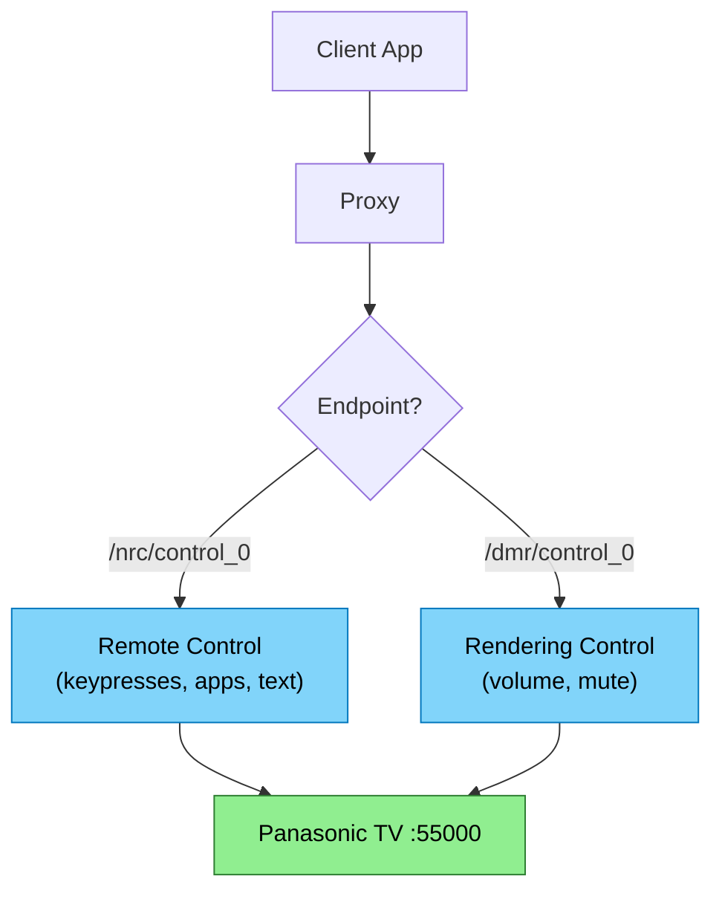
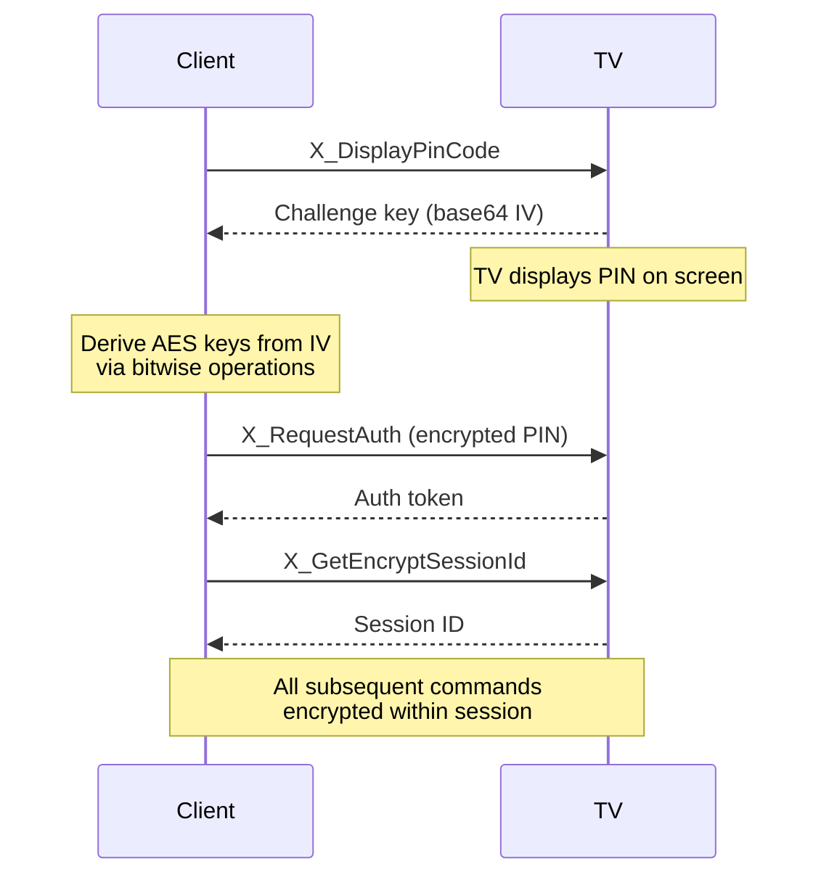

# Findings — Panasonic TV Control APIs

**Question**: What APIs and protocols exist for controlling Panasonic TVs over the network, and how do they compare to the Roku ECP approach already used in this project?

---

**Protocol**: Panasonic Viera TVs expose a SOAP-over-HTTP API on **port 55000**, split across two service endpoints: one for remote control commands (keypresses, app launch, text input) and one for rendering control (volume, mute). No authentication is required on pre-2018 models. Models from 2018 onward require an AES-128-CBC encrypted session established via a PIN pairing handshake. The protocol was never officially documented by Panasonic but has been thoroughly reverse-engineered by the community.

**Platform shift**: Panasonic's 2024+ flagship OLEDs run **Fire TV OS** and LED models run **Google TV**. These likely abandon the Viera SOAP API entirely, shifting control to Amazon/Google ecosystems (ADB, Alexa, Google Home). The Viera API covers pre-2024 models only.

**Feasibility**: The Viera API is structurally similar to Roku ECP (HTTP on the LAN, no auth on older models, same discovery mechanism via SSDP). The proxy architecture already in place for Roku could serve Panasonic commands with a second protocol handler. The encrypted pairing flow for 2018+ models adds complexity but is well-documented in open-source libraries.

---

## Protocol Architecture

The Viera API uses two UPnP service endpoints on the same port, each with a different URN. Remote control and rendering are separate concerns with separate SOAP actions.



*Blue = service endpoints, Green = TV device*

| Endpoint | URN | SOAP Actions |
|----------|-----|--------------|
| `/nrc/control_0` | `panasonic-com:service:p00NetworkControl:1` | `X_SendKey`, `X_SendString`, `X_LaunchApp`, `X_GetAppList` |
| `/dmr/control_0` | `schemas-upnp-org:service:RenderingControl:1` | `GetVolume`, `SetVolume`, `GetMute`, `SetMute` |
| `/nrc/sdd_0.xml` | N/A | Device description (read-only) |

> [florianholzapfel/panasonic-viera](https://github.com/florianholzapfel/panasonic-viera) — Python library with encryption support, maintained, used by Home Assistant
>
> [Turgon37/panasonic-viera](https://github.com/Turgon37/panasonic-viera) — Python/PHP implementation with SOAP templates and key enums

## SOAP Request Format

All commands use the same envelope structure. The URN and action name change per endpoint.

```xml
POST http://<TV_IP>:55000/nrc/control_0
Content-Type: text/xml; charset="utf-8"
SOAPAction: "urn:panasonic-com:service:p00NetworkControl:1#X_SendKey"

<?xml version="1.0" encoding="utf-8"?>
<s:Envelope xmlns:s="http://schemas.xmlsoap.org/soap/envelope/"
  s:encodingStyle="http://schemas.xmlsoap.org/soap/encoding/">
  <s:Body>
    <u:X_SendKey xmlns:u="urn:panasonic-com:service:p00NetworkControl:1">
      <X_KeyEvent>NRC_POWER-ONOFF</X_KeyEvent>
    </u:X_SendKey>
  </s:Body>
</s:Envelope>
```

Volume control uses the DMR endpoint with the UPnP rendering URN:

```xml
POST http://<TV_IP>:55000/dmr/control_0
SOAPAction: "urn:schemas-upnp-org:service:RenderingControl:1#GetVolume"

<!-- Body contains: <InstanceID>0</InstanceID><Channel>Master</Channel> -->
```

`SetVolume` takes a `<DesiredVolume>` parameter (0-100). `SetMute` takes `<DesiredMute>` (0 or 1).

> [LogicMachine Forum — Panasonic Viera IP Control](https://forum.logicmachine.net/showthread.php?tid=232) — SOAP templates, endpoint paths, and volume control details
>
> [Node-RED Panasonic TV Control](https://discourse.nodered.org/t/control-panasonic-tv-with-node-red/12923) — Working request examples with headers

## NRC Key Codes

~90 key codes covering the full physical remote. All follow the `NRC_<NAME>-ONOFF` pattern.

| Category | Keys |
|----------|------|
| **Power** | `NRC_POWER-ONOFF` |
| **Navigation** | `NRC_UP`, `NRC_DOWN`, `NRC_LEFT`, `NRC_RIGHT`, `NRC_ENTER`, `NRC_RETURN`, `NRC_HOME`, `NRC_CANCEL`, `NRC_MENU`, `NRC_SUBMENU` |
| **Numbers** | `NRC_D0` through `NRC_D9` |
| **Volume/Channel** | `NRC_VOLUP`, `NRC_VOLDOWN`, `NRC_MUTE`, `NRC_CH_UP`, `NRC_CH_DOWN` |
| **HDMI Inputs** | `NRC_HDMI1` through `NRC_HDMI4`, `NRC_CHG_INPUT` |
| **Playback** | `NRC_PLAY`, `NRC_PAUSE`, `NRC_STOP`, `NRC_FF`, `NRC_REW`, `NRC_REC`, `NRC_SKIP_NEXT`, `NRC_SKIP_PREV`, `NRC_30S_SKIP` |
| **Colour Buttons** | `NRC_RED`, `NRC_GREEN`, `NRC_BLUE`, `NRC_YELLOW` |
| **Smart/Apps** | `NRC_APPS`, `NRC_INTERNET`, `NRC_VTOOLS`, `NRC_VIERA_LINK`, `NRC_CHG_NETWORK`, `NRC_GAME` |
| **Display** | `NRC_DISP_MODE`, `NRC_ASPECT`, `NRC_3D`, `NRC_SPLIT`, `NRC_SWAP`, `NRC_R_SCREEN`, `NRC_PICTAI`, `NRC_P_NR`, `NRC_SURROUND` |
| **Info/Guide** | `NRC_EPG`, `NRC_GUIDE`, `NRC_INFO`, `NRC_INDEX`, `NRC_HOLD`, `NRC_R_TUNE` |
| **Other** | `NRC_CC`, `NRC_SAP`, `NRC_TEXT`, `NRC_STTL`, `NRC_TV`, `NRC_OFFTIMER`, `NRC_FAVORITE`, `NRC_DIGA_CTL`, `NRC_EZ_SYNC`, `NRC_SD_CARD`, `NRC_CHAT_MODE` |

All keys shown without the `-ONOFF` suffix for brevity. The full code is e.g. `NRC_VOLUP-ONOFF`.

> [florianholzapfel/panasonic-viera keys.py](https://github.com/florianholzapfel/panasonic-viera/blob/main/panasonic_viera/keys.py) — Complete enum of 90 key codes
>
> [Turgon37/panasonic-viera constants.py](https://github.com/Turgon37/panasonic-viera/blob/master/panasonic_viera/constants.py) — 84 key constants with error codes

## Encryption (2018+ Models)

Models from 2018 onward reject unencrypted SOAP requests and require a PIN-based pairing handshake to establish an encrypted session using AES-128-CBC with HMAC-SHA256 signatures.



The pairing is a **one-time operation** per client. After pairing, the session credentials are reused for future connections.

**STUB** — The exact key derivation from IV (bitwise operations) needs verification against a working implementation. The florianholzapfel library and node-panasonic-viera both implement this but the algorithm details are in source code only, not documented.

> [jens-maus/node-panasonic-viera](https://github.com/jens-maus/node-panasonic-viera) — Node.js library supporting both encrypted and unencrypted models
>
> [Node-RED Forum](https://discourse.nodered.org/t/control-panasonic-tv-with-node-red/12923?page=2) — Confirms FZ-series (2019+) requires AES-CBC-128 encryption with HMAC-SHA-256

## Device Discovery

Same mechanism as Roku: **SSDP** multicast on `239.255.255.250:1900`.

| Property | Roku | Panasonic Viera |
|----------|------|-----------------|
| Discovery | SSDP, target `roku:ecp` | SSDP, target `urn:panasonic-com:service:p00NetworkControl:1` |
| Control port | 8060 | 55000 |
| Protocol | HTTP REST (XML responses) | SOAP over HTTP |
| Authentication | None | None (pre-2018), AES-128-CBC (2018+) |
| Volume control | Keypress only (`VolumeUp`/`VolumeDown`) | Direct get/set (0-100) + mute toggle |
| App listing | `GET /query/apps` | `X_GetAppList` SOAP action |
| App launch | `POST /launch/<appId>` | `X_LaunchApp` with product ID |
| Text input | `POST /keypress/Lit_<char>` | `X_SendString` (full string at once) |
| CORS | No | No (assumed — same era, same problem, same proxy solution) |
| Access control | Roku OS 14.1+ limited mode | TV setting: "TV Remote App Settings > Powered On By Apps" |

The SSDP discovery target differs but the proxy already implements SSDP for Roku. Adding a second search target is straightforward.

> [Gist — discover TV control URL for Panasonic Viera](https://gist.github.com/bazzargh/fcb19fbcc814294c0fb59faa568c04f0) — SSDP discovery implementation with endpoint extraction

## 2024+ Platform Shift

Panasonic abandoned their MyHomeScreen OS for 2024 flagships:

| Model Tier | 2024+ Platform | Control Path |
|------------|---------------|--------------|
| Flagship OLED (Z95A, Z93A) | Fire TV OS | ADB, Alexa, HomeKit/AirPlay 2 |
| LED models | Google TV | Android TV Remote protocol, Google Home, ADB |

The Viera SOAP API is tied to MyHomeScreen. Fire TV and Google TV models expose their respective platform APIs instead. If this project wants to support Panasonic's 2024+ lineup, that means implementing Fire TV or Android TV protocols rather than (or in addition to) the Viera API.

> [AFTVnews — Panasonic switches to Fire TV OS](https://www.aftvnews.com/panasonic-switches-to-amazons-fire-tv-os-for-its-2024-flagship-oled-smart-tvs/) — 2024 flagship transition confirmed

## Existing Libraries

| Library | Language | Encrypted | Notes |
|---------|----------|-----------|-------|
| [florianholzapfel/panasonic-viera](https://github.com/florianholzapfel/panasonic-viera) | Python | Yes | Used by Home Assistant, actively maintained |
| [jens-maus/node-panasonic-viera](https://github.com/jens-maus/node-panasonic-viera) | Node.js | Yes | Pre and post-2018 support |
| [Turgon37/panasonic-viera](https://github.com/Turgon37/panasonic-viera) | Python/PHP | No | Older models only |
| [samuelmatis/viera-control](https://github.com/samuelmatis/viera-control) | Node.js | No | REST wrapper + mobile UI |
| [Home Assistant integration](https://www.home-assistant.io/integrations/panasonic_viera/) | Python | Yes | Community maintained, local polling |

> [Home Assistant Panasonic Viera](https://www.home-assistant.io/integrations/panasonic_viera/) — Integration docs including supported features, default port 55000, and NRC command reference

## Gaps and Uncertainties

- **CORS headers almost certainly absent** — No source confirms the Viera SOAP API includes CORS headers, and given the era of the protocol (pre-browser-control), it almost certainly doesn't. The same proxy approach used for Roku applies — all TV commands must route through the proxy.
- **Power-on varies by model** — Some models cannot be powered on remotely. Wake-on-LAN works for some but not all. Home Assistant documents this as a known limitation.
- **No push events** — Like Roku, there's no event subscription. State must be polled.
- **Key derivation algorithm** — The AES key derivation from the challenge IV is implemented in code but not formally documented. Would need to be ported from Python/Node.js to C++ for the proxy.
- **Fire TV / Google TV control** — Not researched in depth. Would be a separate findings document if those platforms are in scope.
- **App IDs for X_LaunchApp** — The format for Panasonic app product IDs (e.g. `"0010000200000001"` for Netflix) and how to discover them at runtime via `X_GetAppList` needs further investigation.
