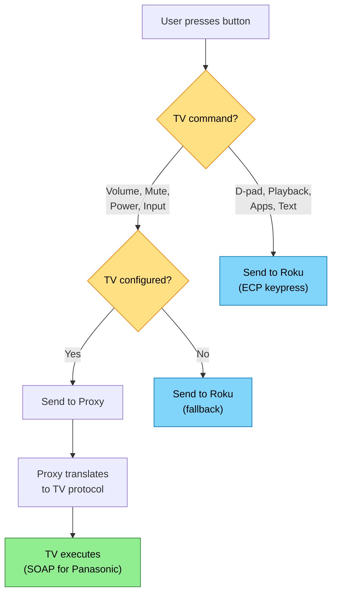

# Flow: TV Control

The user's Roku handles streaming and navigation. Their TV handles volume, mute, power, and input switching. The remote routes commands to the right device automatically — the user just presses buttons.

**Supports:** North Star #5-10, #23

---

## Actors

- **User** — person on the couch with their phone
- **Phone** — running the remote UI in a browser
- **Proxy** — local network helper (C++ or ESP32) that translates commands to device-specific protocols
- **TV** — Panasonic Viera (first supported), future TV types added via the same pattern
- **Roku** — streaming device, receives navigation/playback/app commands as before

---

## Flow A: TV Setup (First Time)

### Trigger

User opens settings and wants to configure their TV for volume/power control.

### Happy Path

1. User opens the settings/setup screen on the remote.
2. User selects a TV type from a list (starting with "Panasonic Viera", plus "None" to disable TV control).
3. User enters the TV's IP address manually. (SSDP discovery via the proxy is possible using `urn:panasonic-com:service:p00NetworkControl:1` as the search target, but manual entry is the reliable fallback.)
4. The proxy attempts to reach the TV — for Panasonic, a `GetVolume` SOAP request to `http://<tv-ip>:55000/dmr/control_0`.
5. **If the TV responds without error**: Connection confirmed. The TV does not require encrypted pairing. Save TV type and IP. Setup complete.
6. **If the TV responds with an encryption/auth error**: The TV is a 2018+ model requiring pairing. Proceed to pairing flow (step 7).
7. The proxy sends `X_DisplayPinCode` to the TV. The TV displays a PIN on screen.
8. User sees "Enter the PIN shown on your TV" in the remote UI. User types the PIN.
9. The proxy completes the challenge-response handshake (AES-128-CBC key derivation, `X_RequestAuth`, `X_GetEncryptSessionId`).
10. **If pairing succeeds**: Save TV type, IP, and session credentials. Setup complete.
11. **If pairing fails**: Show "Pairing failed — check the PIN and try again."

### Why This Flow Exists

The Panasonic Viera API has two eras: pre-2018 (no auth) and 2018+ (encrypted pairing). The user may not know which era their TV belongs to. The setup flow probes the TV and adapts — the user never needs to know.

### Failure Modes

| What Goes Wrong | What Should Happen |
|---|---|
| User enters wrong IP | Timeout → "TV not found at this IP" → re-enter |
| TV is off or unreachable | Timeout → same message, suggest turning TV on first |
| TV is pre-2018, no auth needed | Connection succeeds immediately at step 5 — no pairing needed |
| TV is 2018+, needs pairing | Detected at step 6, user guided through PIN entry |
| User enters wrong PIN | Pairing fails → "Check the PIN and try again" with retry |
| TV type is not Panasonic | Show "not yet supported" for unrecognised types (extensibility point) |
| TV IP changes after setup | Same as Roku IP change — next command fails, prompt for new IP |

---

## Flow B: Command Routing

### Key Constraint: All Commands Route Through the Proxy

The browser cannot talk directly to the Panasonic TV for the same reason it cannot talk directly to the Roku — no CORS headers on the TV's SOAP API. The proxy sits between the phone and both devices, adding CORS headers and translating protocols. This is the same architectural constraint that drove the proxy design for Roku, and it applies to any future TV type.

### Trigger

User presses any button on the remote.

*Blue = Roku path, Green = TV path, Yellow = decision points*

### Stages

**1. Button press classification**
**Actor**: Phone (app logic)
**Action**: Determine whether the pressed button is a TV command or a Roku command.
**Rule**: Volume Up, Volume Down, Mute, Power On, Power Off, and HDMI input selection are TV commands. Everything else is a Roku command.
**Output**: Command routed to the correct device.

**2a. Roku command (unchanged)**
**Actor**: Phone → Proxy → Roku
**Action**: `POST /api/roku/keypress/<key>?ip=<roku-ip>` — same as today.
**Output**: Roku executes the keypress. No change to existing behaviour.

**2b. TV command**
**Actor**: Phone → Proxy → TV
**Action**: Phone sends a device-agnostic TV command to the proxy. The proxy translates it to the TV's native protocol.
**Output**: TV executes the command (volume changes, TV powers on/off, input switches).

**3. Protocol translation (proxy)**
**Actor**: Proxy
**Action**: The proxy maps the generic TV command to the configured TV type's protocol. For Panasonic Viera:
- Volume Up/Down → `SetVolume` SOAP action on `/dmr/control_0` (or `X_SendKey` with `NRC_VOLUP-ONOFF` / `NRC_VOLDOWN-ONOFF`)
- Mute → `SetMute` SOAP action on `/dmr/control_0` (or `X_SendKey` with `NRC_MUTE-ONOFF`)
- Power → `X_SendKey` with `NRC_POWER-ONOFF` on `/nrc/control_0`
- HDMI input → `X_SendKey` with `NRC_HDMI1-ONOFF` through `NRC_HDMI4-ONOFF` on `/nrc/control_0`
**Output**: SOAP request sent to TV.

### Volume Approach Decision

Panasonic offers two ways to control volume:

| Approach | Mechanism | Advantage | Disadvantage |
|----------|-----------|-----------|--------------|
| **Keypress** | `X_SendKey` with `NRC_VOLUP-ONOFF` | Simple, same as all other keys, works on all models | No absolute volume level, no feedback |
| **Direct set** | `SetVolume` on DMR endpoint | Get/set exact level (0-100), can show a volume bar | Extra endpoint, may not work on all models |

Both are viable. Using `X_SendKey` for volume up/down press-and-hold (matching the current Roku pattern) is the simplest starting point. `GetVolume`/`SetVolume` enables a volume slider or level indicator as a future enhancement.

### Failure Modes

| What Goes Wrong | What Should Happen |
|---|---|
| TV unreachable (off, network issue) | Show brief error indicator on the volume button. Roku control continues working. |
| TV command times out | Don't block the UI. Show a transient error, let the user retry. |
| No TV configured, user presses volume | Volume goes to Roku as fallback (existing behaviour). |
| Encrypted session expired (2018+ TV) | Proxy re-authenticates transparently. If that fails, prompt user to re-pair. |
| TV type doesn't support a command (e.g., no HDMI input switching) | Hide or disable the unsupported button for that TV type. |

---

## Flow C: Adding a New TV Type (Future)

### Trigger

A developer wants to add support for a new TV brand (e.g., LG, Samsung, Sony).

### What's Needed

1. A new protocol handler in the proxy that translates generic TV commands (volume, mute, power, input) into the brand's native protocol.
2. The TV type added to the app's settings dropdown.
3. A setup flow for that brand (IP entry, any brand-specific pairing).
4. A findings document for that brand's API (same pattern as `findings-panasonic.md`).

### What Stays the Same

- The app's button layout and routing logic — TV commands are still classified the same way.
- The proxy API contract between the phone and proxy — the phone sends generic TV commands, the proxy translates.
- The user experience — configure TV type in settings, then buttons just work.
