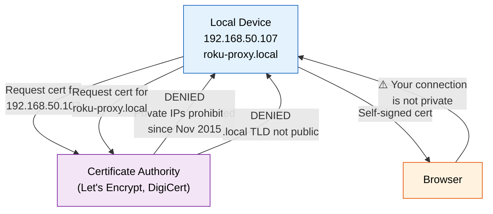
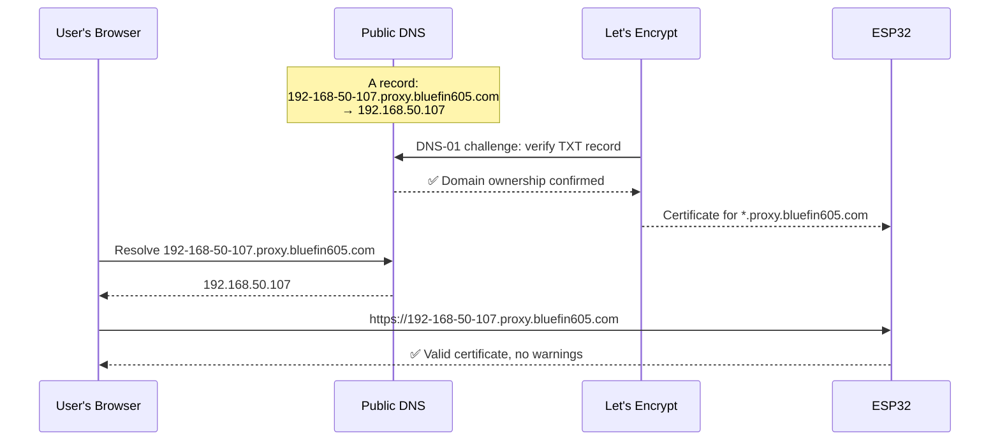
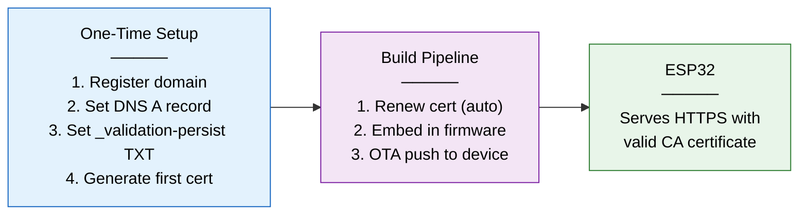
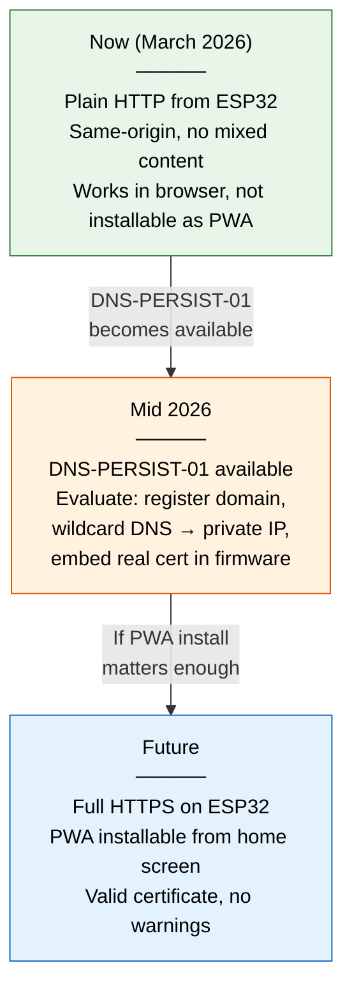

# HTTPS for Local Network Devices

Research into how IoT devices, ESP32 microcontrollers, and local network web UIs handle HTTPS and certificates. Conducted March 2026.

---

## The Industry Standard: Plain HTTP

The vast majority of IoT devices serve their local web UI over plain HTTP. This includes:

- **ESPHome** — no HTTPS support for local web server (long-standing feature request)
- **Tasmota** — HTTP only for local web UI
- **Home Assistant** — uses a reverse proxy (NGINX/Caddy) for HTTPS termination
- **Routers** (Netgear, TP-Link) — HTTP at `192.168.1.1`, some offer self-signed HTTPS with browser warnings
- **Synology/QNAP NAS** — self-signed by default, Let's Encrypt integration available
- **Google Home** — documented as using unencrypted HTTP for local communication

**Why?** Since November 2015, Certificate Authorities are prohibited from issuing certificates for private IP addresses (`192.168.x.x`, `10.x.x.x`) or non-public TLDs like `.local`. There is no legitimate way to get a CA-signed certificate for a local device's address.

---

## The Certificate Problem

---

## Available Approaches

### 1. Plain HTTP (Industry Standard)

Serve over HTTP. Direct browser access to `http://192.168.x.x` works without restrictions. Chrome's HTTPS-first mode (October 2026) explicitly excludes private IPs.

| Pros | Cons |
|------|------|
| Zero complexity | No PWA installability |
| No browser warnings | No service workers |
| No memory/CPU overhead | No encryption (acceptable on trusted LAN) |
| What everyone else does | |

### 2. Self-Signed Certificate

ESP-IDF has built-in HTTPS server support via `esp_https_server` using mbedTLS.

| Spec | Value |
|------|-------|
| RAM per TLS connection | ~40KB |
| Initial handshake time | ~2 seconds |
| Subsequent request latency | <100ms |
| Max concurrent HTTPS connections | ~4 (default buffers) |

| Pros | Cons |
|------|------|
| Encrypted traffic | Scary browser warnings on every visit |
| ESP-IDF native support | Still NOT a "secure context" — no PWA, no service workers |
| | 40KB RAM per connection impacts audio streaming |
| | Users must manually trust cert or click through warning |

### 3. Plex Model (Real Domain + Private IP DNS)

The gold standard, used by Plex for all their local servers.

**How it works:**

1. Own a domain (e.g., `proxy.bluefin605.com`)
2. Set up wildcard DNS so `192-168-50-107.proxy.bluefin605.com` resolves to `192.168.50.107`
3. Get a wildcard certificate from Let's Encrypt using DNS-01 challenge
4. Embed the certificate in the ESP32 firmware
5. Browser sees a valid CA-signed certificate — no warnings, full secure context

| Pros | Cons |
|------|------|
| No browser warnings | Requires domain ownership + DNS API access |
| Full PWA support | Certificate renewal every 90 days |
| Service workers work | Some routers block DNS rebinding (public domain → private IP) |
| Proper encryption | Significant engineering investment |
| | TLS still costs 40KB RAM per connection on ESP32 |

### 4. Reverse Proxy

Run a separate device (Raspberry Pi, NAS) with NGINX/Caddy that terminates TLS and proxies to the ESP32 over HTTP. This is how Home Assistant handles HTTPS.

| Pros | Cons |
|------|------|
| Valid certificates via Let's Encrypt | Requires additional always-on device |
| No TLS overhead on ESP32 | Added network hop and latency |
| Well-documented approach | Infrastructure complexity |

---

## Browser Secure Context Rules

Browsers define "secure contexts" which gate access to modern APIs including service workers and PWA installability.

| Origin | Secure Context? | PWA Install? | Service Workers? |
|--------|----------------|-------------|-----------------|
| `https://` any domain | Yes | Yes | Yes |
| `http://localhost` / `http://127.0.0.1` | Yes | Yes | Yes |
| `http://192.168.x.x` (private IP) | **No** | **No** | **No** |
| `http://device.local` (mDNS) | **No** | **No** | **No** |
| `https://` with self-signed cert | **No** (unless manually trusted in OS) | **No** | **No** |
| `https://` with valid CA cert (Plex model) | Yes | Yes | Yes |

The **only** HTTP exemption is `localhost` / `127.0.0.1`. There are no exemptions for private IP ranges or `.local` addresses.

---

## Chrome Private Network Access (Chrome 142+, September 2025)

Chrome introduced Local Network Access permission prompts:

- **Public → local requests** (e.g., `roku.bluefin605.com` calling `192.168.50.107`) now require user permission via a browser prompt
- **Direct access** to a device by IP in the address bar is NOT affected
- Local devices do NOT need HTTPS — the restriction is on the calling public site

This is why the ESP32 self-hosted approach (same-origin) avoids all PNA issues.

---

## Emerging: Let's Encrypt DNS-PERSIST-01 (Q2 2026)

A new ACME challenge type announced February 2026, specifically designed for IoT:

1. Set a single persistent TXT record at `_validation-persist.yourdomain.com`
2. This record validates ALL future certificate issuances and renewals
3. No further DNS changes needed after initial setup
4. Certificates renew automatically without intervention

This significantly reduces the complexity of the Plex model approach. Once available, the flow would be:

---

## Recommendation for RokuRemote

**Current approach (plain HTTP) is correct.** It matches what the entire IoT industry does. The ESP32 serves both UI and API on the same HTTP origin, avoiding all mixed-content and PNA issues.

**Future path:** When Let's Encrypt DNS-PERSIST-01 reaches production (Q2 2026), evaluate adding HTTPS via the Plex model. This would be the only approach that gives full PWA installability with no browser warnings, and DNS-PERSIST-01 makes certificate renewal trivial. The main concern would be the 40KB RAM per TLS connection on ESP32 — may need the ESP32-S3 with PSRAM to handle TLS + audio streaming simultaneously.

---

## Sources

- [ESP-IDF HTTPS Server Documentation](https://docs.espressif.com/projects/esp-idf/en/latest/esp32/api-reference/protocols/esp_https_server.html)
- [How Plex Does HTTPS for All Its Users](https://words.filippo.io/how-plex-is-doing-https-for-all-its-users/)
- [Chrome Local Network Access](https://developer.chrome.com/blog/local-network-access)
- [Let's Encrypt DNS-PERSIST-01 Announcement](https://letsencrypt.org/2026/02/18/dns-persist-01)
- [MDN: Secure Contexts](https://developer.mozilla.org/en-US/docs/Web/Security/Defenses/Secure_Contexts)
- [MDN: Making PWAs Installable](https://developer.mozilla.org/en-US/docs/Web/Progressive_web_apps/Guides/Making_PWAs_installable)
- [ESPHome HTTPS Feature Request](https://github.com/esphome/feature-requests/issues/2432)
- [Tasmota TLS Discussion](https://github.com/arendst/Tasmota/discussions/23826)
- [Let's Encrypt Community: Certificates for .local Devices](https://community.letsencrypt.org/t/certificates-for-devices-only-reachable-via-local/22908)
